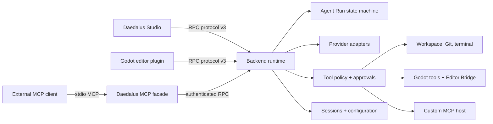

<h1 align="center">Daedalus Backend</h1>

<p align="center">
  The local runtime and execution layer behind Daedalus Studio and the Godot Daedalus editor plugin.
</p>

<p align="center">
  <a href="https://www.npmjs.com/package/daedalus-backend">
    
  </a>
  <a href="https://github.com/LuYingYiLong/daedalus-backend/actions/workflows/ci.yml">
    
  </a>
  <a href="https://github.com/LuYingYiLong/daedalus-backend/releases/latest">
    
  </a>
  
  <a href="https://www.npmjs.com/package/daedalus-backend">
    
  </a>
</p>

<p align="center">
  <a href="https://github.com/LuYingYiLong/daedalus-studio"><strong>Daedalus Studio</strong></a>
  ·
  <a href="#quick-start">Quick start</a>
  ·
  <a href="#architecture">Architecture</a>
  ·
  <a href="#development">Development</a>
  ·
  <a href="./docs/production-binary.md">Production binary</a>
</p>

Daedalus Backend is a TypeScript service for persistent AI-assisted software-development sessions. It owns model-provider routing, agent runs, tool policy, approvals, workspace isolation, Godot operations, MCP integrations, and durable session state. Clients communicate with it over a versioned WebSocket/RPC protocol.

Most users should install [Daedalus Studio](https://github.com/LuYingYiLong/daedalus-studio/releases/latest), which ships a pinned backend binary and manages installation, authentication, health checks, updates, rollback, and repair automatically. Run this repository directly when developing Daedalus, embedding its protocol, using the Godot plugin without Studio, or exposing Daedalus through MCP.

## Highlights

- **Multi-client local runtime** — serves Studio, the Godot editor plugin, CLI/smoke clients, and external MCP clients from one authenticated runtime.
- **Multi-provider model layer** — normalizes streaming, tool calls, reasoning content, multimodal inputs, token budgets, model discovery, and provider-specific request rules.
- **Durable Agent Run state** — routes direct answers, inspections, probes, lightweight edits, and workflows through a single persisted state model.
- **Approval-gated tools** — separates read, verify, propose, write, and destructive operations and preserves continuations without replaying successful writes.
- **Godot-first tooling** — combines static project tools, terminal validation, Editor Bridge patches, LSP/diagnostics, and read-only DAP data.
- **MCP host and servers** — connects external MCP servers and exposes Daedalus, workspace, Godot, terminal, and Skill capabilities over stdio MCP.
- **Local-first persistence** — stores sessions, events, approvals, run checkpoints, configuration, workspaces, and tool ledgers under `%USERPROFILE%\.daedalus`.
- **Verifiable distribution** — publishes both the npm source runtime and a separately versioned Windows x64 single-executable application.

## Architecture



The WebSocket server is the public runtime boundary. Incoming payloads are validated with Zod, associated with an authenticated client and workspace, and dispatched into session, provider, tool, approval, or lifecycle services. The backend never treats model output as authority to bypass tool policy.

## Compatibility

The current release line is coordinated through checked manifests:

| Component | Current contract |
| --- | --- |
| Backend RPC | Protocol v3 |
| Daedalus Studio | 1.0.8 or newer for the current binary line |
| Godot Daedalus plugin | Plugin protocol v3 |
| Godot | 4.5 or newer for the current editor plugin |
| Source runtime | Node.js 24.18.0 or newer |
| Production binary | Windows x64 SEA |

The authoritative values live in `package.json` under `daedalusBinary` and in each release manifest. Studio refuses incompatible binaries and plugin protocols instead of attempting a best-effort connection.

## Quick Start

### Recommended: use Daedalus Studio

Download the latest [Daedalus Studio release](https://github.com/LuYingYiLong/daedalus-studio/releases/latest). Studio includes a verified backend payload and handles its lifecycle. No global npm installation is required.

### Run the npm source runtime

```powershell
npm install --global daedalus-backend

$env:PORT = "38180"
godot-daedalus-backend
```

The npm distribution contains TypeScript source and small JavaScript launchers. It runs through `tsx`, so Node.js 24.18.0 or newer is required. Windows SEA packaging supports Node 24.18.0 or newer within Node 24.

For a project-local installation:

```powershell
npm install daedalus-backend
npm exec godot-daedalus-backend
```

The default development port is `38181`; packaged Studio uses `38180`. Set `PORT` explicitly when another process owns the default port.

### Run the Windows binary

Download and extract `daedalus-backend-win32-x64.zip` from a [backend release](https://github.com/LuYingYiLong/daedalus-backend/releases/latest):

```powershell
.\daedalus-backend.exe version --json
.\daedalus-backend.exe self-test --json
.\daedalus-backend.exe serve
```

Release assets include the payload/release manifests, SHA-256 checksums, and a CycloneDX SBOM. See [docs/production-binary.md](./docs/production-binary.md) for the binary contract and Studio update transaction.

## Provider Layer

The built-in catalog is stored in `src/providers/catalog/` and is the only static source of provider and model metadata. Clients obtain the effective provider state dynamically.

The catalog currently includes DeepSeek, Moonshot/Kimi, OpenAI, Zhipu AI, Alibaba Cloud Qwen, Volcengine Ark, MiniMax, StepFun, iFlytek Spark, OpenCode, Baidu Qianfan, and Xiaomi MiMo. Actual model availability depends on the provider account and endpoint.

The runtime also supports user-defined providers using:

- OpenAI-compatible Chat Completions
- OpenAI Responses
- Anthropic-compatible Messages

Model discovery, local display-name and capability overrides, logical model exclusion/restoration, task-specific model routing, and per-session model binding are managed centrally. API keys are stored through keytar or the platform credential store under provider-scoped accounts; they are not written into ordinary configuration files or returned through RPC.

Independent web-search adapters currently exist for Zhipu AI and Xiaomi MiMo. Web search is an explicit tool operation, is disabled until configured, and does not become available merely because a custom model is marked as search-capable.

## Agent Runs and Workflow

Every accepted request is represented by a persisted Agent Run:

- **direct** — answer without tools.
- **read** — bounded inspection.
- **probe** — hidden read-only discovery when mutation scope is unknown.
- **lightweight** — a small, bounded change with targeted verification and no formal Todo.
- **workflow** — multi-stage, high-risk, or structurally complex execution.

Run state records intent, scope, lane, stage, Todo, pause reason, warnings, verification status, evidence, and write checkpoints. State revisions are monotonic and terminal states are emitted once.

Approvals and tool-budget pauses are recoverable after restart. Active execution is marked interrupted rather than replayed; retry creates a related Run and reuses evidence without automatically repeating successful writes.

## Godot Integration

Daedalus exposes two complementary Godot surfaces:

1. **Static project tools** operate on validated workspace paths and cover scenes, scripts, resources, project settings, Input Map, Autoloads, export presets, dependencies, references, and project analysis.
2. **Editor Bridge tools** are routed to a connected Godot editor and use capability negotiation for typed inspection, scene/resource patches, animation, maps, audio, navigation, previews, reimport, and bake operations.

Editor mutations are preflighted and committed through Godot Undo/Redo. Patch proposals include normalized operations, before/after summaries, warnings, and fingerprints; apply calls reject stale fingerprints rather than partially committing.

Godot LSP and diagnostics are read-only inputs to the agent. The DAP integration does not expose launch, continue, pause, stepping, breakpoints, evaluation, or arbitrary runtime method calls.

## MCP

### External Daedalus MCP facade

`godot-daedalus-mcp` connects an MCP client to a running backend:

```powershell
$env:DAEDALUS_MCP_BACKEND_URL = "ws://127.0.0.1:38180"
godot-daedalus-mcp --lite
```

Modes:

| Mode | Access |
| --- | --- |
| `minimal` | Health, workspaces, sessions, events, plans, and pending approvals |
| `lite` | Minimal tools plus chat, waits, clarification, plan revision, and runtime tools |
| `full` | Lite tools plus plan/tool approval and rejection |

Use `--mode minimal|lite|full`, the corresponding short flag, or `DAEDALUS_MCP_MODE`. Full mode can approve writes and should only be enabled for a trusted local MCP client.

### Built-in stdio servers

When running from the repository, the unified CLI can start individual MCP servers:

```powershell
npm run mcp                 # external Daedalus MCP facade
npm run terminal:mcp        # guarded terminal verification server
npx tsx src/cli.ts mcp workspace
npx tsx src/cli.ts mcp godot
npx tsx src/cli.ts mcp skills
```

Workspace and Godot servers require an explicit project/workspace root. Their path resolvers reject traversal outside the configured boundary.

### Automation MCP

Automation MCP is a development-only smoke surface and is disabled by default:

```powershell
$env:DAEDALUS_AUTOMATION_MCP = "1"
npm run automation:mcp -- --backend-url ws://127.0.0.1:38180
```

See [docs/automation-mcp.md](./docs/automation-mcp.md) for its tool set and approval whitelist.

## Skills

Daedalus discovers Skills from:

- Project: `<workspace>/.github/skills/<slug>/SKILL.md`
- Personal: `%USERPROFILE%\.daedalus\skills\<slug>\SKILL.md`
- Built-in: trusted Skills shipped with the backend

Project and personal Skills are parsed as instructions, not permissions. They cannot grant tools, change tool risk, escape a workspace, or bypass approval. Use `/create-skill <requirements>` for a project Skill or `/create-skill --personal <requirements>` for a personal Skill.

## Security Model

- All external RPC inputs are schema-validated.
- Each connection uses a short-lived local authentication protocol issued by the shared-runtime registry.
- Workspace, `res://`, absolute, and generated paths are resolved and checked against allowed roots.
- Write, destructive, custom MCP, editor mutation, and command execution paths pass through tool policy and approval.
- Provider keys and MCP secrets are separated from non-secret configuration and sanitized from logs and client responses.
- Tool execution uses idempotency and write fingerprints to avoid duplicate effects across continuation, retry, and workflow escalation.
- Validation must match the modified artifact and occur after the relevant write.

No agentic system removes the need for review. Use version control, inspect approvals, and run project-specific tests before shipping generated changes.

## Runtime Data

Daedalus-owned state is registered through `src/app-paths.ts` and stored under `%USERPROFILE%\.daedalus` by default:

```text
backend/       Managed binary versions, current marker, pending update
config/        Non-secret provider, model, routing, search, MCP, and workspace settings
sessions/      Session metadata, events, attachments, diffs, and agent runs
skills/        Personal Skills
logs/          Runtime diagnostics
```

Do not commit this directory. Do not copy it into bug reports without reviewing it for project names, file paths, prompts, and other private data.

## Daedalus Manager

The npm package includes `godot-daedalus-manager`, a JSON-oriented compatibility CLI for backend/plugin installation and diagnostics:

```powershell
godot-daedalus-manager --json status --project "D:\GodotProjects\example"
godot-daedalus-manager --json backend install
godot-daedalus-manager --json backend start --port 38180
godot-daedalus-manager --json backend stop
godot-daedalus-manager --json backend rollback
```

Daedalus Studio production builds use their own verified binary transaction and should normally manage the backend without manual Manager commands.

## Development

### Prerequisites

- Node.js 24.18.0 or newer within Node 24 for the Windows SEA release binary
- npm
- Godot 4.5 or newer for the Windows integration smoke suite
- Windows and the native build toolchain for the SEA release binary

### Install and run

```powershell
git clone https://github.com/LuYingYiLong/daedalus-backend.git
cd daedalus-backend
npm ci
npm run dev
```

Useful checks:

```powershell
npm run typecheck
npm test
npm run check
npm run self-test
npm run smoke:beta
```

Additional scripts:

- `npm run ping` — connect a local protocol-v3 ping client.
- `npm run pack:check` — inspect the npm package whitelist without publishing.
- `npm run smoke:automation` — exercise the Automation RPC/MCP matrix.
- `npm run smoke:llm -- use_llm model_id=<model>` — run a real provider write-and-diff smoke.
- `npm run build:sea:win` — build and smoke-test the Windows x64 single executable.

Tests are organized under `tests/unit`, `tests/contract`, and `tests/integration`. New protocol schemas, tool policies, provider behavior, persistence, paths, and approval flows should include focused tests at the corresponding boundary.

## Repository Layout

```text
src/server/          WebSocket, RPC dispatch, client/session runtime
src/protocol/        Zod schemas and protocol types
src/providers/       Catalog, adapters, streaming, model and search services
src/workflow/        Agent Run state, planning, lightweight and workflow execution
src/tools/           LLM tools, policy, approval, idempotency, event descriptions
src/mcp/             MCP host and built-in stdio servers
src/session/         Persistence, timelines, attachments, run stores
src/prompts/         System prompts and prompt composition
src/skills/          Built-in Skill catalog and loading
src/runtime/         Shared runtime, authentication, build metadata, self-test
tests/               Unit, contract, integration, fixtures, and helpers
docs/                Production, automation, architecture, and release notes
```

## Documentation

- [Production binary and update contract](./docs/production-binary.md)
- [Automation MCP](./docs/automation-mcp.md)
- [Frontend boundary and Studio roadmap](./docs/frontend-boundary-and-studio-roadmap.md)
- [Public Beta release checklist](./docs/beta-release-checklist.md)
- [Source and test layout](./docs/file-structure.md)

## Release Artifacts

The npm package publishes the source runtime and bin launchers. Windows releases additionally publish:

```text
daedalus-backend-win32-x64.zip
daedalus-backend-win32-x64.json
daedalus-backend-win32-x64.cdx.json
SHA256SUMS.txt
```

Tag versions must match `package.json`. Release CI runs the source tests, rebuilds native keytar for the pinned Node runtime, builds the SEA executable, runs its self-test, and verifies compatibility metadata before publishing.

## Related Projects

- [Daedalus Studio](https://github.com/LuYingYiLong/daedalus-studio) — the desktop workbench and managed lifecycle owner.
- [Godot Daedalus](https://github.com/LuYingYiLong/godot-daedalus) — the Godot editor client and Editor Bridge.

## License

Daedalus Backend is distributed under the MIT license, as declared in [`package.json`](./package.json).
